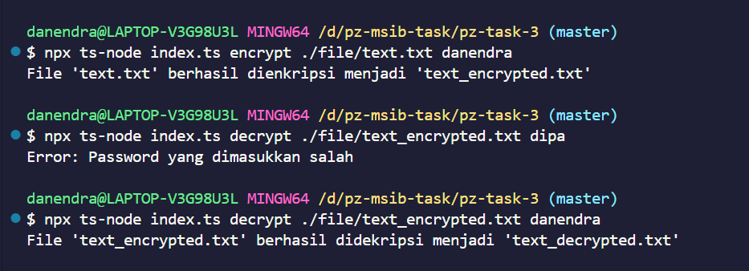

# Task 3 - Danendra Dipa

## Cara Menjalankan Kode
1. Menjalankan encrypt di terminal dengan perintah
    ```bash
    npx ts-node index.ts encrypt pathfile password
    ```
2. Menjalankan decrypt di terminal dengan perintah
    ```bash
    npx ts-node index.ts decrypt pathfile password
    ```

## Screenshot


